# AG-UI Chat Architecture

This document explains the architecture of the minimal-chat application, focusing on how chat history is managed, how the tool execution loop works, and the OpenAI streaming types.

## Table of Contents

- [Overview](#overview)
- [Architecture Diagram](#architecture-diagram)
- [Frontend State Management](#frontend-state-management)
- [The Tool Execution Loop](#the-tool-execution-loop)
- [OpenAI Streaming Types](#openai-streaming-types)
- [AG-UI Protocol Events](#ag-ui-protocol-events)
- [Key Code Locations](#key-code-locations)
- [Message State Evolution Example](#message-state-evolution-example)

---

## Overview

The application follows a **frontend-orchestrated** architecture:

| Component | Role |
|-----------|------|
| **Frontend** | Orchestrator - maintains state, drives the tool loop |
| **Backend** | Stateless - receives full history each request, streams responses |
| **LLM** | Via OpenRouter - generates responses and tool calls |

**Key Insight:** The frontend is the source of truth for conversation history. The backend receives the full message history on every request and has no memory between requests.

---

## Architecture Diagram

```mermaid
sequenceDiagram
    autonumber
    participant User
    participant FE as Frontend<br/>(useChat.ts)
    participant State as React State<br/>(messages[])
    participant BE as Backend<br/>(server.py)
    participant LLM as OpenRouter/LLM

    Note over State: Message[] stores full history:<br/>{ role, content, toolCalls?, toolCallId? }

    %% Initial User Message
    User->>FE: Type message
    FE->>State: Add { role: "user", content: "..." }

    rect rgb(40, 40, 80)
        Note over FE,LLM: sendMessageInternal(messages, depth=0)
        FE->>BE: POST /chat { messages, frontendTools, context }
        Note over BE: chat_request = ChatRequest.model_validate(data)<br/>server.py:762

        BE->>LLM: Stream request with tools

        loop SSE Stream (generate() function)
            LLM-->>BE: ChatCompletionChunk
            BE-->>FE: AG-UI Events (SSE)
        end
    end

    alt Text Response
        Note over FE: EventType.TEXT_MESSAGE_CONTENT
        FE->>State: Update assistant message content
        Note over FE: handleEventWithContext()<br/>useChat.ts:447
    else Tool Call Detected
        Note over BE,FE: TOOL_CALL_START → TOOL_CALL_ARGS → TOOL_CALL_END

        alt Frontend Tool
            Note over FE: Execute handler locally<br/>useChat.ts:478-501
            FE->>State: Add { role: "tool", content: result,<br/>isFrontend: true, toolCallId }
            FE->>FE: return { frontendToolExecuted: true }
        else Backend Tool
            Note over BE: Execute handler on server<br/>server.py:965-1000
            BE-->>FE: TOOL_CALL_RESULT event
            Note over FE: useChat.ts:571-619
            FE->>State: Add { role: "tool", content: result,<br/>isBackend: true, toolCallId }
            FE->>FE: return { backendToolExecuted: true }
        end
    end

    Note over FE: Check shouldFollowUp<br/>useChat.ts:140-142

    alt Tool Was Executed (shouldFollowUp = true)
        rect rgb(80, 40, 40)
            Note over FE,LLM: RECURSIVE: sendMessageInternal(messages, depth+1)
            FE->>BE: POST /chat { updated messages with tool results }
            Note over BE: Messages now include:<br/>- Original user message<br/>- Assistant message with toolCalls[]<br/>- Tool result message(s)
            BE->>LLM: Continue conversation
            LLM-->>BE: Next response (text or more tools)
            BE-->>FE: Stream response
        end
        Note over FE: Loop continues until:<br/>- No tool calls, OR<br/>- depth > MAX_FOLLOW_UP_DEPTH (5)
    else No Tool / Follow-up Disabled
        FE->>State: Final messages
        FE->>User: Display conversation
    end
```



---

## Frontend State Management

### Message Storage

Chat history is stored in React state in `useChat.ts`:

```typescript
const [messages, setMessages] = useState<Message[]>([]);
```

### Message Interface

Each message has the following structure (from `types/index.ts`):

```typescript
interface Message {
  id?: string;                    // Unique message identifier
  role: MessageRole;              // 'user' | 'assistant' | 'system' | 'tool'
  content: string;                // Message content
  isFrontend?: boolean;           // Tool executed on frontend
  isBackend?: boolean;            // Tool executed on backend
  toolCallId?: string;            // Links tool result to tool call
  toolCalls?: ToolCallData[];     // Tool calls made by assistant
  currentTodos?: TodoItem[];      // For todo_write rendering
}

interface ToolCallData {
  id: string;        // Unique tool call ID (e.g., "call_abc123")
  name: string;      // Tool name (e.g., "get_weather")
  arguments: string; // JSON-encoded arguments
}
```

### Why Frontend Stores State

1. **Stateless Backend**: The backend has no memory between requests
2. **OpenAI API Requirement**: Full conversation history must be sent each request
3. **Tool Call Threading**: Tool results must reference their parent tool call via `toolCallId`

---

## The Tool Execution Loop

### How the Loop Works

The loop is driven by **recursive calls** to `sendMessageInternal`:

```typescript
// useChat.ts - simplified
const sendMessageInternal = async (
  currentMessages: Message[],
  depth: number = 0
): Promise<Message[]> => {
  // Guard against infinite loops
  if (depth > MAX_FOLLOW_UP_DEPTH) {  // MAX_FOLLOW_UP_DEPTH = 5
    return currentMessages;
  }

  // Send to backend, process SSE stream
  const response = await fetch('/chat', { ... });
  // ... process events, update messages ...

  // THE KEY PART: Detect if we should loop
  const shouldFollowUp =
    (frontendToolExecuted && !toolAction.disableFollowUp) ||
    backendToolExecuted;

  if (shouldFollowUp) {
    // RECURSE with updated messages
    return sendMessageInternal(updatedMessages, depth + 1);
  }

  return updatedMessages;
};
```

### Two Types of Tools

| Type | Execution | Result Delivery | Follow-up |
|------|-----------|-----------------|-----------|
| **Frontend Tools** | Browser (handler in JS) | Added locally to state | Yes (unless `disableFollowUp`) |
| **Backend Tools** | Server (handler in Python) | Via `TOOL_CALL_RESULT` event | Always |

### Detection Mechanism

Tool execution is detected via **AG-UI protocol events**, not by parsing message content:

```typescript
// useChat.ts - handleEventWithContext()
case EventType.TOOL_CALL_END: {
  // Frontend tool - execute locally
  const result = await contextAction.handler(args);
  return { frontendToolExecuted: true, backendToolExecuted: false };
}

case EventType.TOOL_CALL_RESULT: {
  // Backend tool - result received from server
  return { frontendToolExecuted: false, backendToolExecuted: true };
}
```

---

## OpenAI Streaming Types

When streaming is enabled (`stream=True`), OpenAI returns `ChatCompletionChunk` objects instead of a complete `ChatCompletion`.

### Type Hierarchy

```
Stream[ChatCompletionChunk]
└── ChatCompletionChunk
    ├── id: str                              # Unique completion ID
    ├── object: "chat.completion.chunk"      # Literal string
    ├── created: int                         # Unix timestamp
    ├── model: str                           # Model name
    ├── choices: list[Choice]
    │   └── Choice
    │       ├── index: int                   # Position in choices (usually 0)
    │       ├── delta: ChoiceDelta           # Incremental content
    │       │   ├── role: str | None         # Only in first chunk
    │       │   ├── content: str | None      # Text token(s)
    │       │   ├── tool_calls: list[ChoiceDeltaToolCall] | None
    │       │   │   └── ChoiceDeltaToolCall
    │       │   │       ├── index: int       # Tool call position
    │       │   │       ├── id: str | None   # Only in first chunk
    │       │   │       ├── type: "function" | None
    │       │   │       └── function: ChoiceDeltaToolCallFunction | None
    │       │   │           ├── name: str | None      # Only in first chunk
    │       │   │           └── arguments: str | None # Streamed incrementally
    │       │   └── refusal: str | None
    │       ├── finish_reason: str | None    # "stop", "tool_calls", etc.
    │       └── logprobs: ... | None
    ├── usage: CompletionUsage | None        # Usually only in final chunk
    └── system_fingerprint: str | None
```

### Key Difference: Delta vs Message

| Non-streaming | Streaming |
|--------------|-----------|
| `choices[0].message` | `choices[0].delta` |
| Complete content | Incremental pieces |
| One response | Many chunks |

### Streaming Timeline: Text Response

```
CHUNK 1 (role only):
┌─────────────────────────────────────────┐
│ delta.role = "assistant"                │
│ delta.content = None                    │
│ finish_reason = None                    │
└─────────────────────────────────────────┘

CHUNK 2-N (content tokens):
┌─────────────────────────────────────────┐
│ delta.content = "Hello"                 │
└─────────────────────────────────────────┘
┌─────────────────────────────────────────┐
│ delta.content = " there"                │
└─────────────────────────────────────────┘
┌─────────────────────────────────────────┐
│ delta.content = "!"                     │
└─────────────────────────────────────────┘

FINAL CHUNK:
┌─────────────────────────────────────────┐
│ delta.content = None                    │
│ finish_reason = "stop"                  │
└─────────────────────────────────────────┘
```

### Streaming Timeline: Tool Calls

```
CHUNK 1 (tool call start):
┌─────────────────────────────────────────────────────────────┐
│ delta.tool_calls = [                                        │
│   ChoiceDeltaToolCall(                                      │
│     index = 0,              ← Position for parallel calls   │
│     id = "call_abc123",     ← ONLY in first chunk           │
│     type = "function",                                      │
│     function = {                                            │
│       name = "get_weather", ← Function name (first chunk)   │
│       arguments = ""                                        │
│     }                                                       │
│   )                                                         │
│ ]                                                           │
└─────────────────────────────────────────────────────────────┘

CHUNK 2-N (arguments streaming):
┌─────────────────────────────────────────┐
│ function.arguments = '{"ci'             │  ← JSON streamed
└─────────────────────────────────────────┘     piece by piece
┌─────────────────────────────────────────┐
│ function.arguments = 'ty":'             │
└─────────────────────────────────────────┘
┌─────────────────────────────────────────┐
│ function.arguments = '"Tok'             │
└─────────────────────────────────────────┘
┌─────────────────────────────────────────┐
│ function.arguments = 'yo"}'             │
└─────────────────────────────────────────┘

FINAL CHUNK:
┌─────────────────────────────────────────┐
│ finish_reason = "tool_calls"            │  ← Note: not "stop"
└─────────────────────────────────────────┘

Accumulated: arguments = '{"city":"Tokyo"}'
```

---

## AG-UI Protocol Events

The backend translates OpenAI chunks into AG-UI protocol events:

| Event | Purpose | Key Fields |
|-------|---------|------------|
| `RUN_STARTED` | Lifecycle start | `thread_id`, `run_id` |
| `RUN_FINISHED` | Lifecycle end | `result` |
| `RUN_ERROR` | Error occurred | `message`, `code` |
| `STEP_STARTED` | Step begin | `step_name` |
| `STEP_FINISHED` | Step end | `step_name` |
| `TEXT_MESSAGE_START` | Text begin | `message_id`, `role` |
| `TEXT_MESSAGE_CONTENT` | Text chunk | `message_id`, `delta` |
| `TEXT_MESSAGE_END` | Text end | `message_id` |
| `TOOL_CALL_START` | Tool call begin | `tool_call_id`, `tool_call_name` |
| `TOOL_CALL_ARGS` | Arguments chunk | `tool_call_id`, `delta` |
| `TOOL_CALL_END` | Arguments complete | `tool_call_id` |
| `TOOL_CALL_RESULT` | Tool result (backend only) | `tool_call_id`, `content` |

---

## Key Code Locations

### Frontend (`useChat.ts`)

```
┌─────────────────────────────────────────────────────────────────────────────┐
│  STATE STORAGE                                                               │
│  Line 76:  const [messages, setMessages] = useState<Message[]>([]);          │
│                                                                              │
│  THE LOOP DRIVER                                                             │
│  Line 87-149:  sendMessageInternal(currentMessages, depth)                   │
│                ├─► Builds payload with messages + tools                      │
│                ├─► POST to /chat                                             │
│                ├─► Process SSE stream                                        │
│                └─► if (shouldFollowUp) → RECURSE with depth+1                │
│                                                                              │
│  Line 140-142: shouldFollowUp = frontendToolExecuted || backendToolExecuted  │
│  Line 145:     return sendMessageInternal(updatedMessages, depth + 1);       │
│                                                                              │
│  EVENT HANDLER                                                               │
│  Line 447-682: handleEventWithContext(event, ...)                            │
│                ├─► TOOL_CALL_END: Execute frontend tools                     │
│                └─► TOOL_CALL_RESULT: Receive backend tool results            │
│                                                                              │
│  MESSAGE FORMAT HELPERS                                                      │
│  Line 276-341:  attachToolCallToAssistant()                                  │
│  Line 348-381:  attachOrUpdateTodoWrite()                                    │
└─────────────────────────────────────────────────────────────────────────────┘
```

### Backend (`server.py`)

```
┌─────────────────────────────────────────────────────────────────────────────┐
│  PYDANTIC MODELS                                                             │
│  Line 70-212:  ChatMessage, ChatRequest, ToolCallData, etc.                  │
│                                                                              │
│  REQUEST PARSING                                                             │
│  Line 762:  chat_request = ChatRequest.model_validate(data)                  │
│                                                                              │
│  MESSAGE BUILDING                                                            │
│  Line 640-738:  build_messages_with_context(messages, context, thread_id)    │
│                 ├─► Converts ChatMessage[] → OpenAI format                   │
│                 ├─► Injects context before last user message                 │
│                 └─► Handles tool messages with tool_call_id                  │
│                                                                              │
│  STREAMING GENERATOR                                                         │
│  Line 806-1048: async def generate()                                         │
│                 ├─► Line 833-843: Create LLM stream                          │
│                 │   stream: Stream[ChatCompletionChunk]                      │
│                 ├─► Line 853-943: Process chunks → AG-UI events              │
│                 └─► Line 958-1007: Execute backend tools                     │
└─────────────────────────────────────────────────────────────────────────────┘
```

---

## Message State Evolution Example

```
USER: "Get weather for Tokyo and calculate 2+2"

─────────────────────────────────────────────────────────────────────────────
STEP 1: User sends message
─────────────────────────────────────────────────────────────────────────────
messages = [
  { role: "user", content: "Get weather for Tokyo and calculate 2+2" }
]

─────────────────────────────────────────────────────────────────────────────
STEP 2: LLM responds with tool calls (streamed via AG-UI events)
─────────────────────────────────────────────────────────────────────────────
messages = [
  { role: "user", content: "Get weather for Tokyo and calculate 2+2" },
  {
    role: "assistant",
    content: "",
    toolCalls: [
      { id: "call_1", name: "get_weather", arguments: '{"city":"Tokyo"}' },
      { id: "call_2", name: "calculate", arguments: '{"expression":"2+2"}' }
    ]
  }
]

─────────────────────────────────────────────────────────────────────────────
STEP 3: Backend executes tools, sends TOOL_CALL_RESULT events
─────────────────────────────────────────────────────────────────────────────
messages = [
  { role: "user", content: "..." },
  { role: "assistant", content: "", toolCalls: [...] },
  {
    role: "tool",
    toolCallId: "call_1",
    content: "Weather in Tokyo: 22°C, Sunny",
    isBackend: true
  },
  {
    role: "tool",
    toolCallId: "call_2",
    content: "4",
    isBackend: true
  }
]

─────────────────────────────────────────────────────────────────────────────
STEP 4: Frontend detects backendToolExecuted=true → RECURSES
        sendMessageInternal(messages, depth=1)
─────────────────────────────────────────────────────────────────────────────
→ Sends ALL messages back to backend
→ LLM sees the tool results in context
→ Generates final text response

─────────────────────────────────────────────────────────────────────────────
STEP 5: Final response (no tools) → Loop ends
─────────────────────────────────────────────────────────────────────────────
messages = [
  { role: "user", content: "Get weather for Tokyo and calculate 2+2" },
  { role: "assistant", content: "", toolCalls: [...] },
  { role: "tool", toolCallId: "call_1", content: "Weather in Tokyo...", isBackend: true },
  { role: "tool", toolCallId: "call_2", content: "4", isBackend: true },
  { role: "assistant", content: "The weather in Tokyo is 22°C and sunny. 2+2 equals 4!" }
]

shouldFollowUp = false → Loop ends → Display to user
```

---

## Summary

| Aspect | Implementation |
|--------|----------------|
| **State Location** | Frontend React state (`messages[]`) |
| **State Persistence** | None - backend is stateless |
| **Loop Driver** | Frontend recursive `sendMessageInternal()` |
| **Tool Detection** | AG-UI protocol events (not message parsing) |
| **Loop Termination** | No tool calls OR `depth > 5` |
| **Message Format** | OpenAI-compatible with `toolCalls[]` and `toolCallId` |

---

## References

- [OpenAI Streaming Guide](https://platform.openai.com/docs/guides/streaming-responses)
- [OpenAI Python SDK](https://github.com/openai/openai-python)
- [AG-UI Protocol](https://github.com/ag-ui-protocol/ag-ui)
