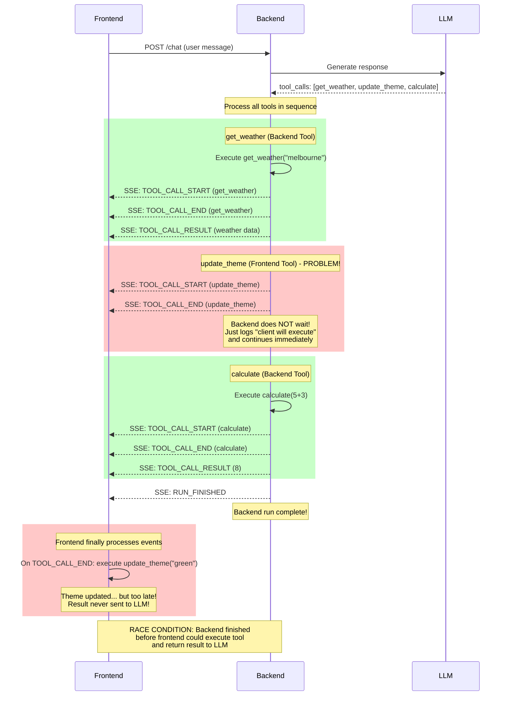
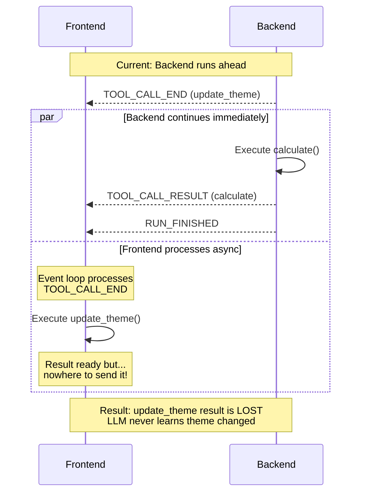
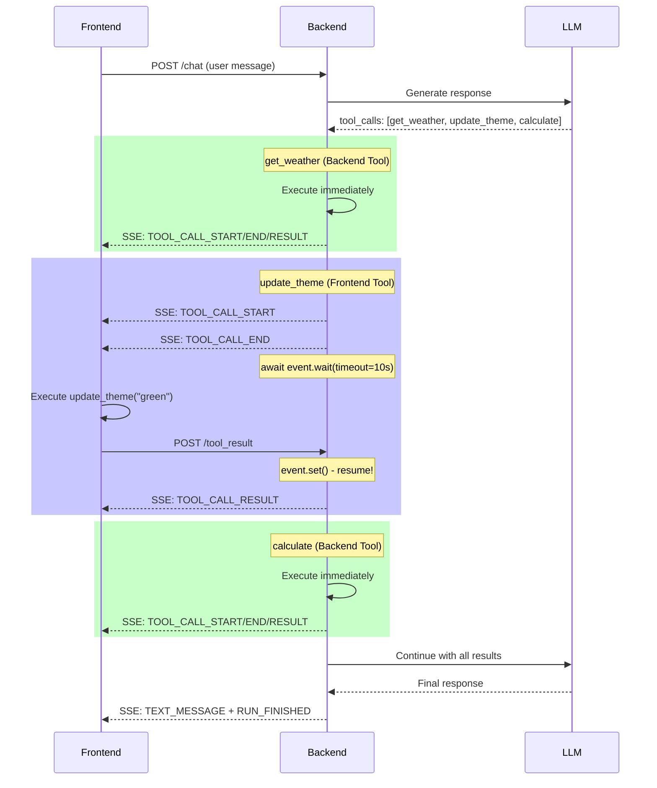
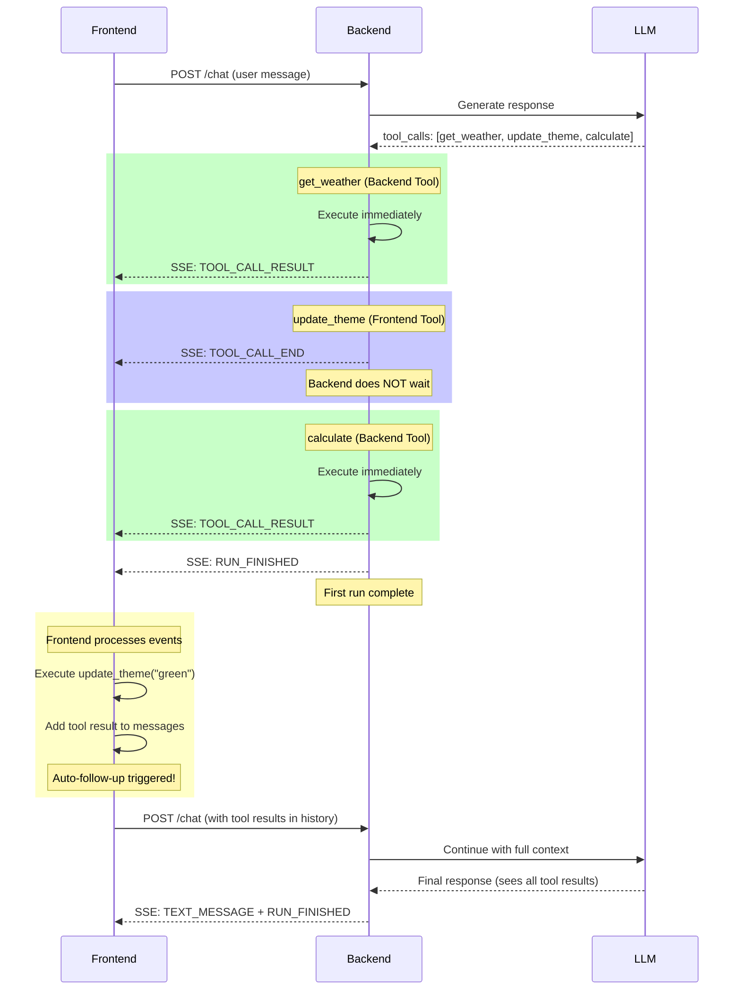

# Fix FE/BE Tool Calling - Race Condition Analysis

## Problem Statement

The current implementation has a critical flaw: **the backend does NOT wait for frontend tool results**. This causes race conditions where frontend tool results are lost.

## Scenario Analysis

Using the test scenario:
1. `get_weather("melbourne")` - **Backend tool**
2. `update_theme("green")` - **Frontend tool**
3. `calculate(5+3)` - **Backend tool**

---

## Current (Broken) Implementation



### Problems Identified:

1. **No waiting mechanism**: Backend emits `TOOL_CALL_END` for frontend tools and immediately continues
2. **No result endpoint**: No `/tool_result` POST endpoint for frontend to send results back
3. **Lost context**: LLM never sees frontend tool results, can't reason about them
4. **Incorrect event usage**: Using `TOOL_CALL_END` to trigger FE execution, but BE doesn't pause

---

## Race Condition Detail



---

## Event Sequence Comparison

### Current (Wrong):
```
BE: TOOL_CALL_START (get_weather)
BE: TOOL_CALL_END (get_weather)
BE: TOOL_CALL_RESULT (get_weather) ← Backend executes, emits result
BE: TOOL_CALL_START (update_theme)
BE: TOOL_CALL_END (update_theme)   ← FE should execute here
BE: TOOL_CALL_START (calculate)    ← But BE already moved on!
BE: TOOL_CALL_END (calculate)
BE: TOOL_CALL_RESULT (calculate)
BE: RUN_FINISHED                   ← Done before FE executes!
FE: [finally processes update_theme] ← Too late, result lost
```

### Correct (With Fix):
```
BE: TOOL_CALL_START (get_weather)
BE: TOOL_CALL_END (get_weather)
BE: TOOL_CALL_RESULT (get_weather) ← Backend tool, immediate
BE: TOOL_CALL_START (update_theme)
BE: TOOL_CALL_END (update_theme)
BE: [PAUSE - waiting for FE]       ← Backend waits!
FE: [executes update_theme]
FE: POST /tool_result              ← FE sends result back
BE: TOOL_CALL_RESULT (update_theme) ← Now BE can emit result
BE: TOOL_CALL_START (calculate)    ← Only now continues
BE: TOOL_CALL_END (calculate)
BE: TOOL_CALL_RESULT (calculate)
BE: RUN_FINISHED
```

---

## Deep Analysis: CopilotKit's Tool Execution Architecture

### Overview

CopilotKit uses an **RxJS observable-based pipeline** for processing tool calls - NOT blocking async/await. This is fundamentally different from what we might expect.

### Backend Tool Execution

**Execution Flow:**
1. LLM generates tool calls with streaming
2. Events flow through `RuntimeEventSource`
3. `processRuntimeEvents()` transforms raw events using RxJS operators
4. State tracking via `scan()` operator accumulates tool call state
5. `concatMap()` operator executes server-side actions sequentially when `ActionExecutionEnd` arrives
6. Results returned as `TOOL_CALL_RESULT` events

**Event Sequence:**
```
TOOL_CALL_START → TOOL_CALL_ARGS* → TOOL_CALL_END →
[Backend executes tool] → TOOL_CALL_RESULT
```

**Key Detail:** Uses `concatMap()` from RxJS for sequential execution - it's a **queue-based processor**, not blocking waits.

---

### Frontend Tool Execution

**How CopilotKit Triggers Frontend Tools:**
```typescript
useCopilotAction({
  name: "myTool",
  description: "...",
  parameters: [ /* JSON Schema */ ],
  handler: async ({ param1 }) => {
    // Execute on frontend
    return "result";
  }
})
```

**Exact Event Sequence:**
```
Backend sends via SSE:
  TOOL_CALL_START {toolCallId: "123", toolName: "myTool"}
  → TOOL_CALL_ARGS {toolCallId: "123", delta: "{...}"}
  → TOOL_CALL_END {toolCallId: "123"}

Frontend receives, executes locally:
  → Calls handler function
  → Gets result

Frontend sends via HTTP POST:
  POST /tool_result
  {
    "tool_call_id": "123",
    "result": "execution result"
  }

Backend processes result:
  → Emits TOOL_CALL_RESULT event
  → Injects tool message back to LLM
```

---

### The Waiting Mechanism - Does CopilotKit Actually Wait?

**Short Answer: NO - Not in the blocking sense.**

CopilotKit implements a **decoupled, callback-based pattern**:

**For Backend Tools:**
- Uses RxJS `concatMap()` which **queues executions sequentially**
- Not "waiting" in async/await sense - it's a **queue processor**

**For Frontend Tools:**
- Backend is **NOT waiting** for the frontend
- Flow is:
  1. Backend emits TOOL_CALL_START/ARGS/END events
  2. Backend **continues processing** (doesn't block)
  3. Frontend receives over SSE, executes, POSTs result back
  4. When result arrives at backend HTTP endpoint, it's processed
  5. Backend correlates with agent context via `toolCallId`

**RxJS Pattern Used:**
```typescript
processRuntimeEvents(events$) {
  return events$.pipe(
    scan((state, event) => {
      // Track tool calls, accumulate args
      return newState;
    }),
    concatMap((state) => {
      if (state.shouldExecuteAction) {
        return executeAction(state.action);
      }
      return of(state);
    }),
  );
}
```

---

### Known Issues in CopilotKit

| Issue | Description |
|-------|-------------|
| **#1499** | External LangGraph agents don't wait for frontend tool results |
| **#2011** | Handler result not awaited - only appended with next user message |
| **#2587** | Race condition with multiple concurrent tool calls |
| **#2684** | Strict event ordering (TOOL_CALL_END must complete before next) |
| **#2567** | TOOL_CALL_ARGS serialization fails with non-JSON objects |

---

### CopilotKit Architecture Diagram

```
┌─────────────────┐
│   Frontend      │
│   React App     │
└────────┬────────┘
         │ registers tools via useCopilotAction
         │
┌────────v──────────────────────────────────────┐
│     CopilotKit Backend                        │
│  ┌──────────────────────────────────────────┐ │
│  │  1. LLM generates tool call              │ │
│  │     TOOL_CALL_START/ARGS/END events      │ │
│  └────────────┬──────────────────┬──────────┘ │
│               │                  │            │
│               v                  v            │
│    Backend tool?        Frontend tool?        │
│    Execute on           Send via SSE          │
│    server via           (stream to client)    │
│    concatMap()          ↓                     │
│    ↓                    Client executes       │
│    Return               ↓                     │
│    TOOL_CALL_RESULT     POST result back      │
│    ↓                    ↓                     │
│    Inject to LLM        Correlate via         │
│                         toolCallId            │
│                         ↓                     │
│                         Emit TOOL_CALL_RESULT │
│                         ↓                     │
│                         Inject to LLM         │
└──────────────────────────────────────────────┘
```

---

### Key Architectural Principles

1. **Event-driven**: Everything flows through structured AG-UI events
2. **Async/non-blocking**: No thread blocking, RxJS handles concurrency
3. **Callback-based**: Frontend tools use HTTP POST callback pattern
4. **Sequential execution**: Backend tools execute via `concatMap()` for ordering
5. **State management**: RxJS `scan()` tracks accumulated state

---

### AG-UI Protocol Event Types

**Tool Call Events (4 types):**
- `TOOL_CALL_START` - `{ toolCallId, toolName, parentMessageId? }`
- `TOOL_CALL_ARGS` - `{ toolCallId, delta }` (incremental JSON)
- `TOOL_CALL_END` - `{ toolCallId }`
- `TOOL_CALL_RESULT` - `{ toolCallId, content: "result" }`

**Other Categories:**
- **Lifecycle**: RUN_STARTED, RUN_FINISHED, RUN_ERROR, STEP_STARTED, STEP_FINISHED
- **Text**: TEXT_MESSAGE_START, TEXT_MESSAGE_CONTENT, TEXT_MESSAGE_END
- **State**: STATE_SNAPSHOT, STATE_DELTA, MESSAGES_SNAPSHOT

---

### Conclusion: What We Need to Do Differently

CopilotKit's approach has known issues with frontend tool waiting. Their callback pattern works but:
- Results sometimes only incorporated with **next user message**
- External agents sometimes **don't wait** at all

**Our solution** should implement **explicit blocking** with `asyncio.Event` to guarantee:
1. Backend pauses until frontend responds
2. Result is immediately available to LLM
3. No race conditions

---

### Sources

- [CopilotKit GitHub - Issue #1499](https://github.com/CopilotKit/CopilotKit/issues/1499)
- [CopilotKit GitHub - Issue #2011](https://github.com/CopilotKit/CopilotKit/issues/2011)
- [AG-UI Protocol Documentation](https://docs.ag-ui.com/concepts/events)
- [CopilotKit Backend Runtime](https://deepwiki.com/CopilotKit/CopilotKit/4-backend-runtime-system)
- [useCopilotAction Reference](https://docs.copilotkit.ai/reference/hooks/useCopilotAction)

---

## Implementation Plan

### User Requirements
- **Timeout**: 10 seconds
- **On Timeout**: Abort entire run
- **Transport**: Separate POST endpoint (simpler than modifying SSE stream)

### Backend Changes (`backend/server.py`)

#### 1. Add pending tool call tracking (global state)
```python
from asyncio import Event
from dataclasses import dataclass

@dataclass
class PendingToolCall:
    event: Event
    result: Any = None
    error: str | None = None

# Global registry for pending frontend tool calls
pending_frontend_tools: dict[str, PendingToolCall] = {}
```

#### 2. Add `/tool_result` POST endpoint
```python
class ToolResultRequest(BaseModel):
    tool_call_id: str
    result: Any
    error: str | None = None

@app.post("/tool_result")
async def receive_tool_result(request: ToolResultRequest):
    if request.tool_call_id not in pending_frontend_tools:
        raise HTTPException(404, f"Unknown tool_call_id: {request.tool_call_id}")

    pending = pending_frontend_tools[request.tool_call_id]
    pending.result = request.result
    pending.error = request.error
    pending.event.set()  # Resume the waiting coroutine

    return {"status": "ok"}
```

#### 3. Modify frontend tool handling to wait
```python
# In process_tool_calls() or similar:
if is_frontend_tool(tool_name):
    # Emit events so FE knows to execute
    yield create_sse_event("TOOL_CALL_START", {...})
    yield create_sse_event("TOOL_CALL_END", {...})

    # Create pending entry and wait
    pending = PendingToolCall(event=Event())
    pending_frontend_tools[tool_call_id] = pending

    try:
        # Wait up to 10 seconds for FE to POST result
        await asyncio.wait_for(pending.event.wait(), timeout=10.0)

        if pending.error:
            raise Exception(f"Frontend tool error: {pending.error}")

        tool_result = pending.result
        yield create_sse_event("TOOL_CALL_RESULT", {...})

    except asyncio.TimeoutError:
        # Abort entire run
        yield create_sse_event("RUN_ERROR", {
            "message": f"Frontend tool '{tool_name}' timed out after 10s"
        })
        return  # Exit the generator
    finally:
        del pending_frontend_tools[tool_call_id]
```

### Frontend Changes (`frontend/src/hooks/useChat.ts`)

#### 1. POST tool result after execution
```typescript
// In TOOL_CALL_END handler:
case EventType.TOOL_CALL_END: {
    const toolCallId = event.toolCallId;
    const toolName = pendingToolCalls.get(toolCallId)?.name;

    if (isFrontendTool(toolName)) {
        try {
            const result = await executeFrontendTool(toolName, args);

            // POST result back to backend
            await fetch(`${baseUrl}/tool_result`, {
                method: 'POST',
                headers: { 'Content-Type': 'application/json' },
                body: JSON.stringify({
                    tool_call_id: toolCallId,
                    result: result
                })
            });
        } catch (error) {
            // POST error back to backend
            await fetch(`${baseUrl}/tool_result`, {
                method: 'POST',
                headers: { 'Content-Type': 'application/json' },
                body: JSON.stringify({
                    tool_call_id: toolCallId,
                    result: null,
                    error: error.message
                })
            });
        }
    }
    break;
}
```

#### 2. Remove auto-follow-up for frontend tools
The current auto-follow-up mechanism creates a new request. This should be removed since the backend now waits and continues the same run.

### Type Changes (`frontend/src/types/index.ts`)

```typescript
interface ToolResultRequest {
    tool_call_id: string;
    result: any;
    error?: string;
}
```

---

## Correct Flow (After Fix)



---

## Files to Modify

| File | Changes |
|------|---------|
| `backend/server.py` | Add `/tool_result` endpoint, add waiting mechanism with asyncio.Event, 10s timeout |
| `frontend/src/hooks/useChat.ts` | POST results to `/tool_result`, remove auto-follow-up |
| `frontend/src/types/index.ts` | Add `ToolResultRequest` type |

---

## Testing Strategy

1. **Unit test**: Backend waiting mechanism with mock frontend
2. **E2E test**: Mixed tool scenario (BE tool → FE tool → BE tool)
3. **Timeout test**: Verify run aborts after 10s if FE doesn't respond
4. **Error test**: FE tool throws error, verify error propagates

---

## Critical Review (2025-12-18)

After thorough codebase analysis, several concerns have been identified with the original implementation plan above.

### Issue 1: asyncio.Event Inside SSE Generator - RISKY

**Problem**: The plan proposes adding `await asyncio.wait_for(event.wait(), timeout=10.0)` inside the async generator at `server.py:803`.

**Technical Concerns**:
- **10-second silence**: Client sees no SSE data while backend waits, may timeout or disconnect
- **Violates SSE expectations**: SSE should stream continuously, not pause for extended periods
- **Connection management**: Some proxies/CDNs/load balancers drop idle SSE connections after 30-60s
- **No heartbeat**: During the wait, no keepalive events are sent

**Recommendation**: If blocking is required, send periodic heartbeat events during the wait, or consider the alternative approach below.

### Issue 2: Removing Auto-Follow-Up Breaks Tool Chaining

**Problem**: The plan (line 451-452) proposes removing auto-follow-up after adding POST.

**Why This Breaks Things**:
- Server receives POST `/tool_result` but has **no trigger to call LLM again**
- User must manually send another message to continue
- Multi-step workflows and chained tools completely break
- The LLM cannot autonomously continue after receiving frontend tool results

**Recommendation**: Keep auto-follow-up OR implement explicit server-side continuation trigger.

### Issue 3: Critical Frontend Bug - `isLoading` Not Reset on RUN_ERROR

**Location**: `frontend/src/hooks/useChat.ts:680-689`

**Current Code**:
```typescript
case EventType.RUN_ERROR:
  console.error('[AG-UI] Run error:', event.message, 'code:', event.code);
  setMessages([...currentMessages, { role: 'assistant', content: `Error: ${event.message}` }]);
  break;  // isLoading is NEVER reset!
```

**Impact**: If timeout occurs, frontend UI freezes permanently - input stays disabled.

**Required Fix** (must be added regardless of approach):
```typescript
case EventType.RUN_ERROR:
  console.error('[AG-UI] Run error:', event.message, 'code:', event.code);
  setMessages([...currentMessages, { role: 'assistant', content: `Error: ${event.message}` }]);
  // Note: isLoading will be reset in the finally block of sendMessage()
  // but we should signal to stop processing
  break;
```

### Issue 4: No Timeout-Specific Error Codes

**Current**: All errors emit `code="RUNTIME_ERROR"` (server.py:1043)

**Problem**: Frontend cannot distinguish timeout from other errors.

**Required Fix**: Add specific error codes:
```python
# For timeout
yield encoder.encode(RunErrorEvent(message=f"Frontend tool '{tool_name}' timed out", code="TIMEOUT_ERROR"))

# For tool execution errors
yield encoder.encode(RunErrorEvent(message=str(e), code="TOOL_ERROR"))
```

---

## Alternative Approach: Option B - Keep Auto-Follow-Up (RECOMMENDED)

Based on analysis of CopilotKit's actual implementation and the AG-UI protocol, a **simpler and more robust approach** is to keep the current auto-follow-up mechanism while optionally adding POST for server-side persistence.

### Why This Approach is Better

| Aspect | Original Plan (asyncio.Event) | Option B (Auto-Follow-Up) |
|--------|-------------------------------|---------------------------|
| SSE streaming | Pauses for 10s (bad UX) | Continuous flow |
| Complexity | High (sync primitives) | Low (existing mechanism) |
| Tool chaining | Works but fragile | Works naturally |
| Failure modes | Timeout = dead stream | Graceful degradation |
| CopilotKit alignment | Different pattern | Same pattern |

### How It Works



### Option B Implementation

#### Backend Changes: MINIMAL

Only add `/tool_result` endpoint for **optional persistence/logging** (not for synchronization):

```python
# backend/server.py - Add near line 1056

class ToolResultRequest(BaseModel):
    """Optional endpoint for frontend to report tool results (for logging/persistence)."""
    tool_call_id: str
    tool_name: str
    result: Any
    error: str | None = None
    thread_id: str | None = None

@app.post("/tool_result")
async def receive_tool_result(request: ToolResultRequest):
    """
    Optional endpoint for frontend to report tool execution results.
    This is for logging/persistence only - NOT for synchronization.
    The auto-follow-up mechanism handles LLM continuation.
    """
    logger.info(f"📥 Tool result received: {request.tool_name} ({request.tool_call_id})")
    if request.error:
        logger.error(f"   Tool error: {request.error}")
    else:
        result_preview = str(request.result)[:100]
        logger.info(f"   Result: {result_preview}...")

    # Could store in database for analytics/debugging
    # Could emit to monitoring system

    return {"status": "ok", "message": "Result logged (follow-up handles continuation)"}
```

#### Frontend Changes: KEEP AUTO-FOLLOW-UP

The current implementation at `useChat.ts:173-179` is CORRECT. Keep it as-is:

```typescript
// useChat.ts:173-179 - KEEP THIS
const shouldFollowUp =
  (frontendToolExecuted && toolAction && !toolAction.disableFollowUp) ||
  backendToolExecuted;

if (shouldFollowUp) {
  return sendMessageInternal(updatedMessages, depth + 1);
}
```

Optionally add POST for logging (non-blocking):

```typescript
// useChat.ts - In TOOL_CALL_END handler after execution (line ~555)
if (contextAction) {
  const result = await Promise.resolve(contextAction.handler(args));

  // Optional: POST result for server-side logging (fire-and-forget)
  fetch(`${API_URL}/tool_result`, {
    method: 'POST',
    headers: { 'Content-Type': 'application/json' },
    body: JSON.stringify({
      tool_call_id: event.toolCallId,
      tool_name: toolCall.name,
      result: result,
      thread_id: threadIdRef.current,
    }),
  }).catch(err => console.warn('Tool result logging failed:', err));

  // Continue with existing logic...
  const updatedWithToolCall = attachToolCallToAssistant(...);
  // ...
  return { frontendToolExecuted: true, ... };  // Triggers auto-follow-up
}
```

### Critical Fix Required: Reset isLoading on Error

Regardless of which approach is chosen, this bug MUST be fixed:

```typescript
// useChat.ts - Modify sendMessage function (lines 185-208)
const sendMessage = useCallback(async (content: string) => {
  if (!content.trim() || isLoading) return;

  const userMessage: Message = { role: 'user', content };
  const newMessages = [...messages, userMessage];
  setMessages(newMessages);
  setIsLoading(true);

  try {
    const finalMessages = await sendMessageInternal(newMessages, 0);
    setMessages(finalMessages);
  } catch (error) {
    const errorMessage = error instanceof Error ? error.message : 'Unknown error';
    setMessages((prev) => [
      ...prev,
      {
        role: 'assistant',
        content: `Error: ${errorMessage}. Make sure the server is running on localhost:8000`,
      },
    ]);
  } finally {
    setIsLoading(false);  // This already exists and handles cleanup
  }
}, [messages, isLoading, sendMessageInternal]);
```

The `finally` block already resets `isLoading`, but ensure the stream processing doesn't hang indefinitely. Add a timeout to the fetch:

```typescript
// useChat.ts - Add timeout to fetch (line ~103)
const controller = new AbortController();
const timeoutId = setTimeout(() => controller.abort(), 120000); // 2 minute timeout

try {
  const response = await fetch(`${API_URL}/chat`, {
    method: 'POST',
    headers: { 'Content-Type': 'application/json' },
    body: JSON.stringify(payload),
    signal: controller.signal,
  });
  // ... rest of processing
} finally {
  clearTimeout(timeoutId);
}
```

---

## Comparison: Option A vs Option B

| Criterion | Option A (asyncio.Event) | Option B (Auto-Follow-Up) |
|-----------|--------------------------|---------------------------|
| **Complexity** | High - sync primitives, global state | Low - existing mechanism |
| **SSE behavior** | Pauses (bad UX) | Continuous streaming |
| **Tool result to LLM** | Same request | Next request (full history) |
| **Failure handling** | Timeout aborts run | Graceful degradation |
| **Connection issues** | May drop during wait | Natural HTTP lifecycle |
| **CopilotKit alignment** | Different pattern | Same pattern |
| **Testing complexity** | High (timing-dependent) | Low (request-response) |
| **Debugging** | Harder (async state) | Easier (sequential) |

**Recommendation**: Use **Option B** unless there's a specific requirement for same-request tool result injection that cannot be satisfied by message history reconstruction.

---

## Files to Modify (Updated)

### For Option A (Original Plan)
| File | Changes |
|------|---------|
| `backend/server.py` | Add `/tool_result` endpoint, asyncio.Event waiting, heartbeat during wait |
| `frontend/src/hooks/useChat.ts` | POST results, add fetch timeout, fix error handling |
| `frontend/src/types/index.ts` | Add `ToolResultRequest` type |

### For Option B (Recommended)
| File | Changes |
|------|---------|
| `backend/server.py` | Add optional `/tool_result` endpoint for logging |
| `frontend/src/hooks/useChat.ts` | Optional fire-and-forget POST, add fetch timeout |
| Both approaches | Fix RUN_ERROR handling (already in finally block) |

---

## Decision Checklist

Before implementing, confirm:

- [ ] Which approach (A or B)?
- [ ] Is same-request tool result injection required, or is next-request OK?
- [ ] Acceptable timeout duration (10s proposed)?
- [ ] Should `/tool_result` POST be required or optional?
- [ ] Need server-side tool result persistence (database)?
- [ ] Need specific error codes for timeout vs other errors?
